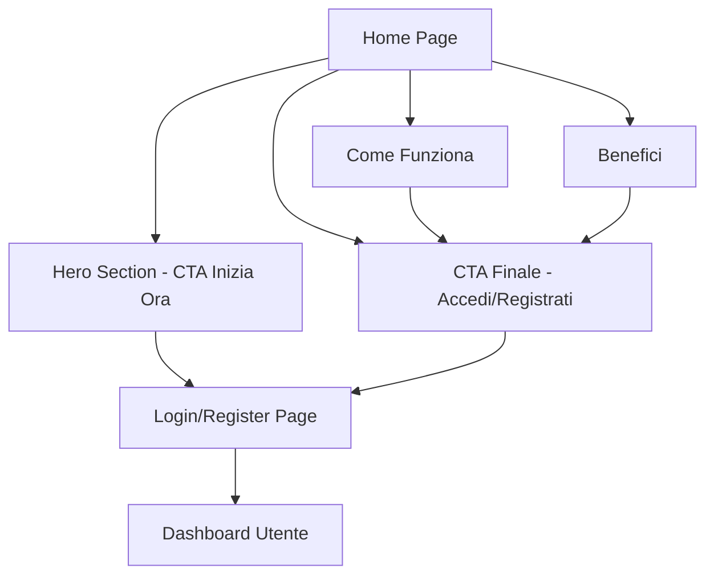

## 1. Product Overview
Capitale Personale è una piattaforma di apprendimento strutturato che trasforma il modo di studiare attraverso percorsi guidati, fasi progressive e sistema di flashcard. La nuova Home Page serve come punto di ingresso professionale per spiegare il valore del metodo e guidare gli utenti verso l'inizio del loro percorso formativo.

- Risolve il problema della gestione disorganizzata dello studio personale
- Serve studenti e professionisti che vogliono un metodo strutturato di apprendimento
- Offre controllo dei progressi e continuità nel processo di apprendimento

## 2. Core Features

### 2.1 User Roles
| Ruolo | Metodo di Registrazione | Permessi Core |
|------|---------------------|------------------|
| Utente Base | Registrazione email | Accesso a percorsi, studio per fasi, flashcard |
| Utente Autenticato | Login con credenziali | Dashboard personale, salvataggio progressi, statistiche |

### 2.2 Feature Module
La Home Page di Capitale Personale consiste nelle seguenti sezioni principali:
1. **Hero Section**: titolo orientato al valore, sottotitolo esplicativo, call to action principale
2. **Come Funziona**: descrizione del percorso guidato, studio per fasi, sistema di progressione
3. **Benefici**: apprendimento strutturato, continuità, controllo dei progressi
4. **Call to Action Finale**: invito all'azione, accesso login/registrazione

### 2.3 Page Details
| Page Name | Module Name | Feature description |
|-----------|-------------|---------------------|
| Home Page | Hero Section | Mostra titolo "Capitale Personale" con payoff sul valore dell'apprendimento strutturato, sottotitolo che spiega il metodo in 1-2 righe, pulsante CTA principale "Inizia Ora" che porta a login/registrazione |
| Home Page | Come Funziona | Tre card visuali che illustrano: percorso guidato (icone step), studio per fasi (icone progressione), controllo avanzamento (icone statistiche). Layout orizzontale desktop, verticale mobile |
| Home Page | Benefici | Sezione con tre elementi: apprendimento strutturato (icona libro/grafico), continuità (icona percorso), controllo progressi (icona dashboard). Testi brevi e iconografie coerente |
| Home Page | CTA Finale | Banner con sfondo colorato, titolo "Inizia il tuo percorso", sottotitolo "Unisciti a migliaia di studenti che hanno trasformato il loro metodo di studio", due pulsanti: "Accedi" e "Registrati" |
| Home Page | Navigation Bar | Logo Capitale Personale a sinistra, menu minimal (Home, Come Funziona, Inizia), pulsanti login/registrazione a destra. Sticky on scroll |
| Home Page | Footer | Links essenziali: Privacy, Termini, Contatti. Logo e copyright. Design pulito e professionale |

## 3. Core Process
L'utente atterra sulla Home Page e visualizza immediatamente il valore proposto attraverso la Hero Section. Può scegliere di:
1. Cliccare "Inizia Ora" nella hero per procedere direttamente alla registrazione
2. Scorrendo, leggere come funziona il sistema e i benefici offerti
3. Utilizzare la navigation bar per accedere direttamente al login se già registrato
4. Raggiungere la CTA finale dopo aver compreso il valore della piattaforma

## 4. User Interface Design

### 4.1 Design Style
- **Colori Primari**: Blu professionale #1E40AF (primary), Bianco #FFFFFF (background), Grigio scuro #1F2937 (testi)
- **Colori Secondari**: Verde successo #10B981 (accenti positivi), Grigio chiaro #F3F4F6 (sfondi secondari)
- **Button Style**: Pulsanti arrotondati (border-radius: 8px), ombra leggera, hover effect con transizione smooth
- **Typography**: Font sans-serif moderno (Inter o system font), titoli 32-48px, corpo testo 16-18px
- **Layout**: Card-based design con spaziatura generosa, grid system responsive, contenuto centrato max-width 1200px
- **Icone**: Stile linea sottile (outline), coerenti nella dimensione (24-32px), colori monocromatici con accenti colorati

### 4.2 Page Design Overview
| Page Name | Module Name | UI Elements |
|-----------|-------------|-------------|
| Home Page | Hero Section | Layout full-width con sfondo gradiente blu-bianco, titolo 48px bold centrato, sottotitolo 20px regular, CTA button 18px semibold con padding 16px 32px, animazione fade-in on load |
| Home Page | Come Funziona | Grid 3 colonne desktop/1 colonna mobile, card con border-radius 12px, ombra Card shadow-sm, icone 48px colorate, titoli card 20px semibold, testi 16px regular |
| Home Page | Benefici | Sezione con background alternato (grigio chiaro), lista verticale con icone 32px allineate a sinistra, titoli 18px semibold, descrizioni 16px regular, spaziatura 24px tra elementi |
| Home Page | CTA Finale | Banner full-width con background blu primary, testo bianco centrato, titolo 32px bold, sottotitolo 18px regular, due pulsanti affiancati con spaziatura 16px, stile primary/secondary |
| Home Page | Navigation Bar | Altezza 64px, background bianco con ombra, logo 32px a sinistra, menu link 16px semibold, pulsanti auth 14px medium, tutti gli elementi verticalmente centrati |

### 4.3 Responsiveness
Desktop-first approach con breakpoint mobile a 768px. Tutte le sezioni si adattano fluidamente:
- Hero text scala da 48px a 32px
- Grid passa da 3 a 1 colonna
- Navigation collassa in hamburger menu
- Pulsanti mantengono dimensioni touch-friendly (min 44px)

### 4.4 Animazioni e Interazioni
- Scroll smooth per navigazione interna
- Fade-in animations per elementi in viewport
- Hover effects su card e pulsanti (scale 1.02, shadow enhancement)
- Transizioni di 0.3s ease-in-out per tutti gli stati interattivi