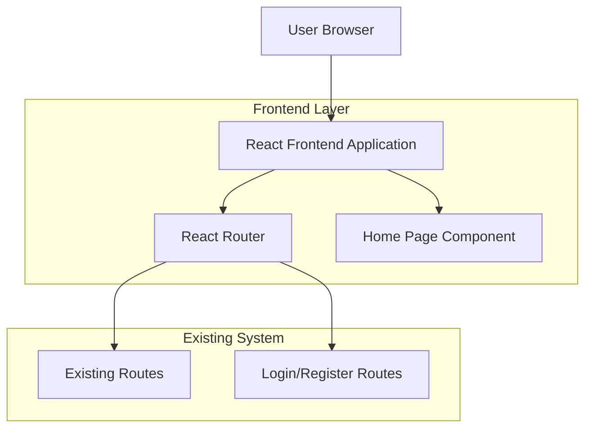

## 1. Architecture design



## 2. Technology Description
- Frontend: React@18 + tailwindcss@3 + vite
- Initialization Tool: vite-init
- Backend: None (utilizza sistema esistente)
- Routing: React Router DOM
- Styling: Tailwind CSS con componenti custom
- Animations: CSS transitions + React Intersection Observer per scroll animations

## 3. Route definitions

| Route | Purpose |
|-------|---------|
| / | Home Page - Pagina introduttiva con sezioni Hero, Come Funziona, Benefici |
| /login | Login Page - Accesso utenti esistente (già implementato) |
| /register | Register Page - Registrazione nuovi utenti (già implementato) |
| /dashboard | Dashboard Page - Area personale utente (già implementato) |
| /paths | Percorsi di studio (già implementato) |
| /phases | Fasi di apprendimento (già implementato) |

## 4. Component Structure

### 4.1 Home Page Components
```
src/
├── components/
│   ├── home/
│   │   ├── HeroSection.jsx
│   │   ├── HowItWorksSection.jsx
│   │   ├── BenefitsSection.jsx
│   │   ├── FinalCTASection.jsx
│   │   └── HomePage.jsx
├── pages/
│   └── HomePage.jsx
└── styles/
    └── home.css
```

### 4.2 Component Props Interface

HeroSection Component
```typescript
interface HeroSectionProps {
  onPrimaryCTAClick: () => void;
  className?: string;
}
```

HowItWorksSection Component
```typescript
interface HowItWorksSectionProps {
  className?: string;
}

interface HowItWorkItem {
  icon: React.ComponentType<{ className?: string }>;
  title: string;
  description: string;
}
```

BenefitsSection Component
```typescript
interface BenefitsSectionProps {
  className?: string;
}

interface BenefitItem {
  icon: React.ComponentType<{ className?: string }>;
  title: string;
  description: string;
}
```

FinalCTASection Component
```typescript
interface FinalCTASectionProps {
  onLoginClick: () => void;
  onRegisterClick: () => void;
  className?: string;
}
```

## 5. Integration Guidelines

### 5.1 Navigation Integration
- La Home Page non modifica il routing esistente
- Utilizza Link component da React Router per navigazione interna
- Mantiene coerenza con stili e comportamenti esistenti
- Preserva tutte le route e funzionalità attuali

### 5.2 Authentication Flow
- CTA buttons reindirizzano a /login o /register
- Nessuna logica di autenticazione aggiuntiva
- Utilizza flussi auth già implementati
- Preserva sessioni e stati utente esistenti

### 5.3 State Management
- Nessuno stato globale aggiuntivo richiesto
- Componenti Home sono stateless con props
- Eventuali animazioni gestite con useEffect locale
- Nessuna interferenza con Redux/Context esistenti

## 6. Performance Considerations

### 6.1 Code Splitting
- Home Page component separato per lazy loading opzionale
- Icone importate dinamicamente se necessario
- Immagini ottimizzate con lazy loading
- CSS separato per evitare bundle bloat

### 6.2 Rendering Optimization
- React.memo per componenti puri
- useMemo per calcoli costanti
- Event listener cleanup in useEffect
- Intersection Observer per animazioni performanti

## 7. Browser Compatibility
- Chrome 90+, Firefox 88+, Safari 14+, Edge 90+
- CSS Grid e Flexbox supportati
- Intersection Observer con fallback
- Touch events per mobile interaction