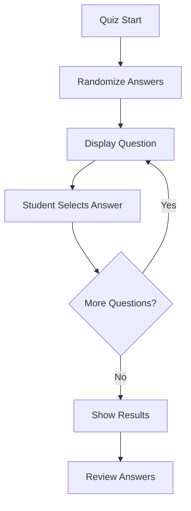

## 1. Product Overview
Problema di randomizzazione delle risposte nei quiz generati automaticamente. Le risposte corrette apparivano sempre in prima posizione, rendendo il quiz troppo prevedibile per gli utenti.

## 2. Core Features

### 2.1 User Roles
| Role | Registration Method | Core Permissions |
|------|---------------------|------------------|
| Student | Email registration | Can take quizzes, view results |
| Teacher | Email registration | Can create quizzes, view student progress |
| Admin | System assignment | Can manage all content and users |

### 2.2 Feature Module
Il sistema di quiz richiede le seguenti pagine principali:
1. **Quiz Interface**: visualizzazione domande, opzioni di risposta, navigazione tra domande
2. **Results Page**: punteggio finale, risposte corrette/errate, possibilità di ripetere
3. **Quiz Creation**: per teachers/admin, creazione domande con opzioni multiple

### 2.3 Page Details
| Page Name | Module Name | Feature description |
|-----------|-------------|---------------------|
| Quiz Interface | Question Display | Mostra domanda corrente con 4 opzioni di risposta in ordine random |
| Quiz Interface | Answer Selection | Permette selezione singola risposta, validazione immediata |
| Quiz Interface | Navigation | Pulsanti Avanti/Indietro, progress bar, timer opzionale |
| Results Page | Score Display | Mostra punteggio percentuale, numero risposte corrette |
| Results Page | Answer Review | Lista domande con risposta data vs risposta corretta |
| Quiz Creation | Question Builder | Editor testuale per domanda, 4 campi opzioni, selezione corretta |
| Quiz Creation | Settings | Timer, numero domande, materia, difficoltà |

## 3. Core Process
### Student Flow
Lo studente accede al quiz, visualizza domande con opzioni in ordine randomizzato, seleziona risposte, riceve feedback immediato e può rivedere i risultati finali.

## 4. User Interface Design
### 4.1 Design Style
- Colori primari: blu scuro (#1e3a8a) per header, bianco per background
- Colori secondary: verde (#10b981) per risposte corrette, rosso (#ef4444) per errate
- Stile bottoni: rounded corners, shadow leggera, hover effects
- Font: Inter o Roboto, 16px per testo normale, 20px per domande
- Layout: card-based per domande, top navigation per progresso

### 4.2 Page Design Overview
| Page Name | Module Name | UI Elements |
|-----------|-------------|-------------|
| Quiz Interface | Question Card | Card centrata, padding 24px, domanda in bold 20px |
| Quiz Interface | Answer Options | 4 bottoni verticali, equal width, radio button style |
| Quiz Interface | Progress Bar | Top bar con percentuale completamento, colore primario |
| Results Page | Score Card | Grande numero percentuale, icona trofeo/medaglia |
| Results Page | Answer List | Scrollable list, colori verde/rosso per stato risposta |

### 4.3 Responsiveness
Desktop-first design con adattamento mobile. Su mobile le opzioni di risposta occupano larghezza completa con maggiore spaziatura verticale per facilitare touch interaction.