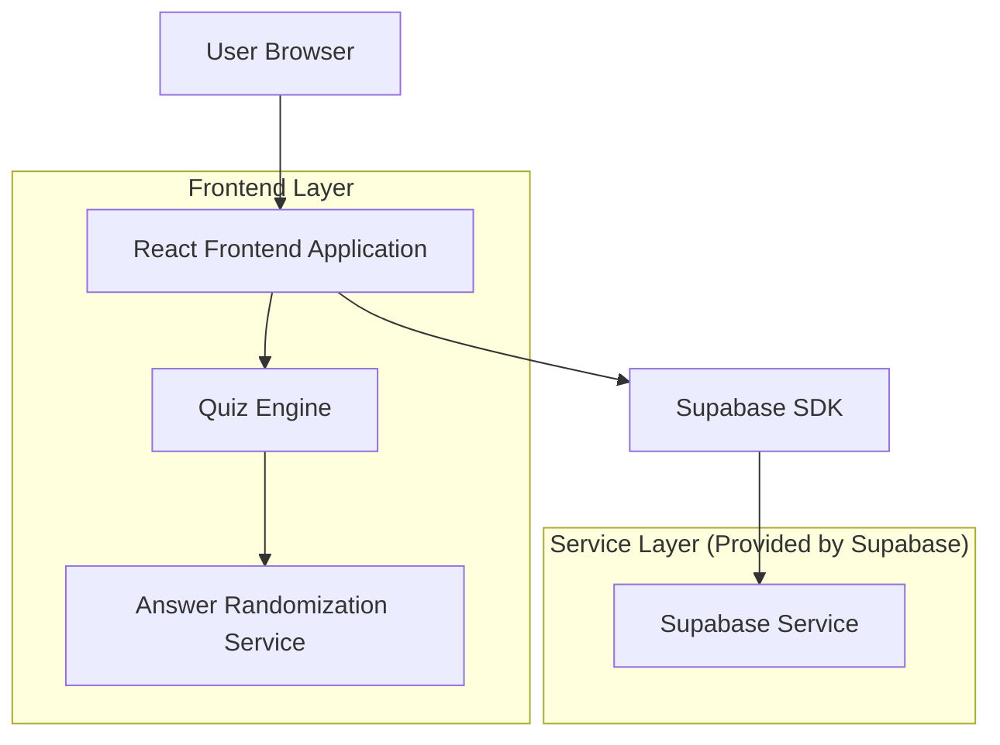
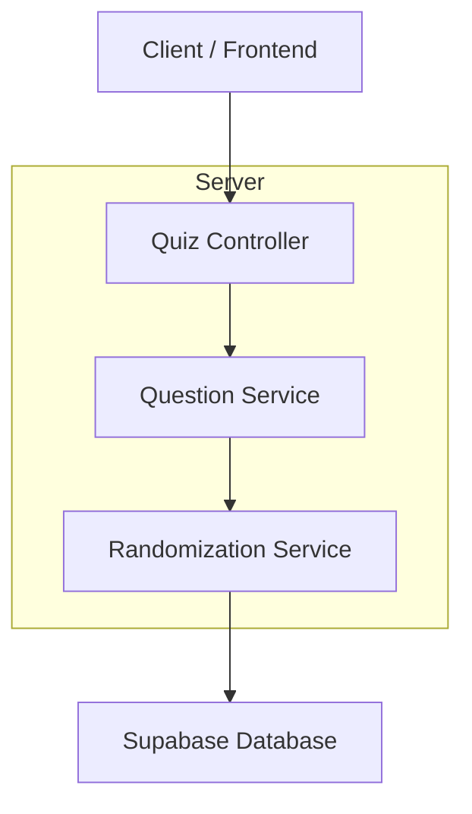
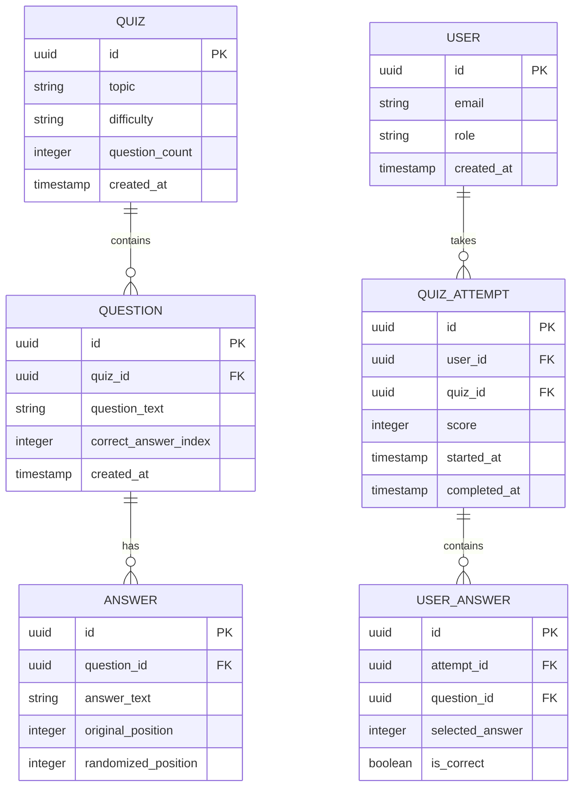

## 1. Architecture design



## 2. Technology Description
- Frontend: React@18 + tailwindcss@3 + vite
- Initialization Tool: vite-init
- Backend: Supabase
- Database: Supabase PostgreSQL

## 3. Route definitions
| Route | Purpose |
|-------|---------|
| /quiz/:id | Quiz interface, displays questions with randomized answers |
| /quiz/:id/results | Results page showing score and answer review |
| /quiz/create | Quiz creation interface for teachers |
| /dashboard | User dashboard with quiz history and statistics |

## 4. API definitions
### 4.1 Core API

Quiz generation and randomization
```
POST /api/quiz/generate
```

Request:
| Param Name| Param Type  | isRequired  | Description |
|-----------|-------------|-------------|-------------|
| topic     | string      | true        | Quiz topic/subject |
| difficulty| string      | false       | Quiz difficulty level |
| questionCount| number   | false       | Number of questions (default: 10) |

Response:
| Param Name| Param Type  | Description |
|-----------|-------------|-------------|
| quizId    | string      | Unique quiz identifier |
| questions | array       | Array of question objects with randomized answers |

Example
```json
{
  "topic": "storia romana",
  "difficulty": "medio",
  "questionCount": 5
}
```

## 5. Server architecture diagram


## 6. Data model

### 6.1 Data model definition


### 6.2 Data Definition Language
Quiz Table (quizzes)
```sql
-- create table
CREATE TABLE quizzes (
    id UUID PRIMARY KEY DEFAULT gen_random_uuid(),
    topic VARCHAR(255) NOT NULL,
    difficulty VARCHAR(50) DEFAULT 'medium',
    question_count INTEGER DEFAULT 10,
    created_at TIMESTAMP WITH TIME ZONE DEFAULT NOW(),
    updated_at TIMESTAMP WITH TIME ZONE DEFAULT NOW()
);

-- create index
CREATE INDEX idx_quizzes_topic ON quizzes(topic);
CREATE INDEX idx_quizzes_created_at ON quizzes(created_at DESC);

-- grant permissions
GRANT SELECT ON quizzes TO anon;
GRANT ALL PRIVILEGES ON quizzes TO authenticated;
```

Questions Table (questions)
```sql
-- create table
CREATE TABLE questions (
    id UUID PRIMARY KEY DEFAULT gen_random_uuid(),
    quiz_id UUID REFERENCES quizzes(id) ON DELETE CASCADE,
    question_text TEXT NOT NULL,
    correct_answer_index INTEGER NOT NULL CHECK (correct_answer_index >= 0 AND correct_answer_index <= 3),
    created_at TIMESTAMP WITH TIME ZONE DEFAULT NOW(),
    updated_at TIMESTAMP WITH TIME ZONE DEFAULT NOW()
);

-- create index
CREATE INDEX idx_questions_quiz_id ON questions(quiz_id);

-- grant permissions
GRANT SELECT ON questions TO anon;
GRANT ALL PRIVILEGES ON questions TO authenticated;
```

Answers Table (answers)
```sql
-- create table
CREATE TABLE answers (
    id UUID PRIMARY KEY DEFAULT gen_random_uuid(),
    question_id UUID REFERENCES questions(id) ON DELETE CASCADE,
    answer_text TEXT NOT NULL,
    original_position INTEGER NOT NULL,
    randomized_position INTEGER NOT NULL,
    created_at TIMESTAMP WITH TIME ZONE DEFAULT NOW()
);

-- create index
CREATE INDEX idx_answers_question_id ON answers(question_id);
CREATE INDEX idx_answers_randomized_position ON answers(randomized_position);

-- grant permissions
GRANT SELECT ON answers TO anon;
GRANT ALL PRIVILEGES ON answers TO authenticated;
```